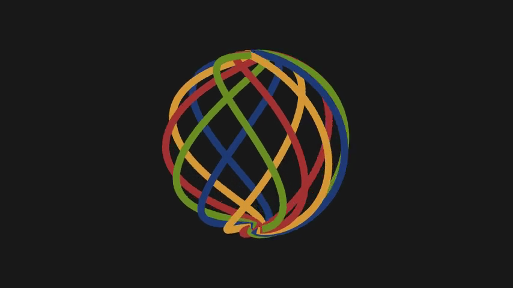

# DiffGeom Loxodromes

A 3D animation of a sphere composed of interleaving loxodromic spirals (rhumb lines) in an Autumn color palette, created with Manim.

## Preview



## Mathematical Model

Loxodromes (rhumb lines) are curves on a sphere that cross all meridians at a constant angle. The parametric equations are:

$$\lambda = \frac{1}{\tan(\beta)} \cdot \ln\left(\tan\left(\frac{\phi}{2} + \frac{\pi}{4}\right)\right) + \delta$$

where:
- $\phi$ is the latitude (parameter $t$), ranging from $-\pi/2$ to $\pi/2$
- $\lambda$ is the longitude, computed from the loxodrome equation
- $\beta$ controls the spiral steepness (angle with meridians)
- $\delta$ is the phase offset for spacing multiple ribbons

### Cartesian Conversion

$$x = R \cos(\phi) \cos(\lambda)$$
$$y = R \cos(\phi) \sin(\lambda)$$
$$z = R \sin(\phi)$$

## Parameters

| Parameter | Value | Effect |
|-----------|-------|--------|
| R | 2.5 | Sphere radius |
| NUM_RIBBONS | 12 | Total spiral strips covering the sphere |
| TURNS | 2 | Number of times each spiral winds around |

## Color Palette

The "Autumn" palette cycles through:
- Navy Blue (`#1f3b75`)
- Mustard Yellow (`#d69836`)
- Maroon (`#a33232`)
- Olive Green (`#6b8e23`)

## Installation

```bash
pip install -r requirements.txt
```

Requires:
- manim >= 0.17.0
- numpy >= 1.24.0

System dependencies:
- ffmpeg
- cairo

## Rendering

```bash
# Low quality (fast preview)
manim -pql src/loxodrome_scene.py LoxodromeAutumn

# High quality
manim -pqh src/loxodrome_scene.py LoxodromeAutumn
```

## Animation Sequence

1. **Ribbon Creation** (4s): Lagged spiral drawing from pole to pole
2. **Camera Rotation**: Ambient rotation reveals spherical symmetry
3. **Pulse Effect** (2s): Subtle scale breathing animation
4. **Hold** (3s): Final rotation before stopping

## Output

Videos are generated in `media/videos/loxodrome_scene/`.
